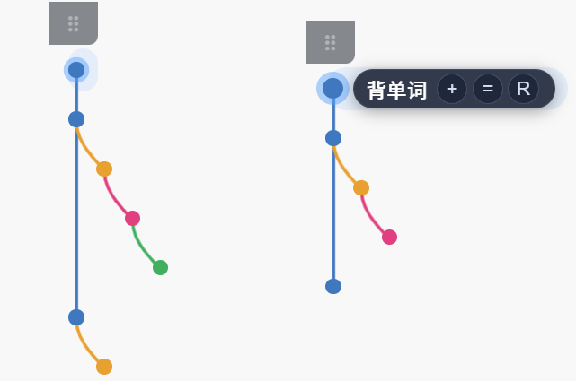

# I'm back 🌿

> [English](README.md) | **中文**

> 一个桌面任务树悬浮窗，工作原理像调用栈——完成一个任务后自动**返回**到它的父任务，就像函数返回到调用方。


---

## 这是什么？

**I'm back** 是一个极简的、始终置顶的桌面任务树悬浮窗。它以 Git Graph 风格渲染你的任务树——一条垂直主干，带有彩色分支线——让你每次专注于*一个节点*。

核心理念：用**树形结构**代替平铺的待办列表。完成一个任务后，焦点自动上移到父节点。就像调用栈弹出一帧。



---

## 功能特性
- ## **默认置顶，拖拽上方手柄进行移动**
- **Git Graph 可视化** — Canvas 绘制的垂直主干与彩色分支线。
- **调用栈焦点模型** — 完成或删除任务 → 焦点自动返回父节点。
- **极简悬浮窗体验** — 默认只显示圆点；悬停节点后展示标题和操作按钮。
- **鼠标穿透** — 透明区域的点击会直接穿透到下方桌面。
- **边缘吸附** — 拖动窗口到屏幕左/右边缘自动吸附并收起。
- **点击翻译** — 点击拖拽手柄（⠿）打开内嵌英中词典（由 MyMemory 提供）。
- **会话持久化** — 按 `Ctrl+S` 保存；下次启动恢复到上次离开的位置。
- **历史记录** — 每个会话自动存档为快照。按 `Ctrl+H` 打开历史面板，以卡片形式浏览历史会话，**一键恢复**任意一次。
- **软删除 + 撤销/重做** — 最多 200 步完整快照级别的撤销历史。
- **系统托盘** — 显示/隐藏、始终置顶切换、历史记录（`Ctrl+H`）、保存（`Ctrl+S`）、退出。

---

## 快速上手
直接试用release里面的setup文件进行安装，或者按照以下步骤搭建运行环境。
## 如果需要自己打包
### 前置条件

- [Node.js](https://nodejs.org/) 18+
- Windows（鼠标穿透和边缘吸附为 Windows 专有功能；其他功能跨平台可用）

### 克隆项目并运行

```bash
git clone https://github.com/zett721/im-back
cd im-back
npm install
npm start
```

Windows 下也可以直接双击 `start.vbs`，不会弹出黑色命令窗口。

### 打包安装程序（Windows）

```bash
npm run dist
```

`.exe` 安装包将生成在 `dist/` 目录中。

> **图标说明：** 如需自定义安装包图标，在项目根目录放置一个 `icon.ico`（与 `icon.png` 同级）。  
> 可用任意工具转换（如 [cloudconvert.com](https://cloudconvert.com/png-to-ico)）。缺少 `icon.ico` 不影响打包，会使用默认图标。

---

## 键盘快捷键

| 快捷键 | 操作 |
|---|---|
| `Ctrl+N` | 添加子任务 |
| `Ctrl+Shift+N` | 添加同级任务 |
| `Enter` | 重命名当前节点 |
| `Ctrl+Enter` | **完成**当前节点（返回父节点） |
| `Delete` | **删除**当前节点（返回父节点） |
| `Ctrl+Z` / `Ctrl+Y` | 撤销 / 重做 |
| `Ctrl+S` | 保存会话（下次启动时恢复） |
| `Ctrl+H` | 切换历史记录面板 |
| `Esc` | 关闭输入框 / 历史面板 / 翻译弹窗 |

---

## 项目结构

```
im-back/
├── main.js                  # Electron 主进程（窗口、托盘、IPC）
├── preload.cjs              # 上下文桥接：向渲染进程暴露安全 API
├── src/
│   ├── main/
│   │   ├── app-controller.js   # 外观层：通过 Promise 队列串行化所有操作
│   │   ├── tree-state.js       # 核心状态机（树增删改 + 撤销/重做）
│   │   └── session-store.js    # 持久化（active.json、事件日志、快照）
│   └── renderer/
│       ├── index.html
│       ├── app.js              # 所有 UI 逻辑 + Canvas 图形渲染
│       └── styles.css
└── tests/
    └── run-tests.js
```

### 架构概览

```
用户输入（键盘 / 点击）
        │
        ▼
renderer/app.js  ──IPC──►  AppController.enqueue()
                                    │
                                    ▼
                           TreeStateMachine       ← 内存状态 + 撤销栈
                                    │
                                    ▼
                           SessionStore           ← 事件日志 + 防抖写入 active.json
```

每个写操作都会：
1. 立即应用到内存中的 `TreeStateMachine`（实时响应）。
2. 追加写入纯文本事件日志（审计轨迹）。
3. 在 250ms 防抖后原子写入 `active.json`（通过临时文件重命名）。

---

## 数据存储

所有数据存放在 Electron 的 `userData` 目录（Windows 下为 `%APPDATA%\im-back\sessions\`）：

| 文件 | 说明 |
|---|---|
| `active.json` | 当前活跃会话状态 |
| `continue.flag` | 该文件存在时，下次启动将继续当前会话 |
| `YYYY-MM-DD_HH-mm-ss.events.log` | 每次会话的人类可读事件日志 |
| `YYYY-MM-DD_HH-mm-ss.snapshot.json` | 上次会话结束时的自动存档快照 |

---

## 运行测试

```bash
npm test
```

---

## 参与贡献

欢迎贡献！请：

1. Fork 本仓库并创建功能分支。
2. 保持改动聚焦——每个 PR 只解决一个问题。
3. 提交前运行 `npm test`。
4. 较大改动请先开 Issue 讨论方案。

---

## 许可证

[MIT](LICENSE)
